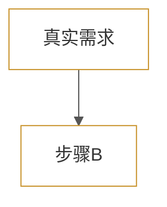
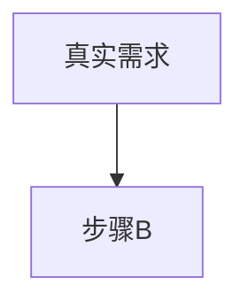

# Halo Mermaid 渲染最佳实践

## 背景

Fluid 主题内置 Mermaid 渲染器，` ```mermaid ` 代码块会被自动渲染为 SVG 矢量图。

## 核心陷阱：Mermaid 不渲染折叠内容

**Mermaid JS 只在页面加载时处理可见元素。** 放在 `<details>` 折叠块内的 mermaid 代码块不会被渲染为 SVG。

### ✅ 正确做法

Mermaid 代码块（SVG 图）直接暴露在正文中可见，
源码用 `<details>` 折叠放在下方：

```markdown


<details>
<summary style="cursor:pointer;color:#c9942e;font-size:13px;">📐 查看流程图源码</summary>

```text
graph TD
  A["真实需求"] --> B["步骤B"]
```

</details>
```

### ❌ 错误做法（Mermaid 不会渲染）

```markdown
<details>
<summary>展开看图</summary>


```

</details>

## 主题配置方法

Mermaid 默认蓝色底（`rgb(236,236,255)`）在浅灰页面背景上违和。

### 方法 A：内联 init（推荐，精确可控）

每个 ` ```mermaid ` 代码块的第一行加：

```mermaid
%%{init: {'theme': 'base', 'themeVariables': {'primaryColor': '#ffffff', 'primaryBorderColor': '#c9942e', 'lineColor': '#555555', 'tertiaryColor': '#f8f8f8'}}}%%
```

| 变量 | 值 | 效果 |
|------|-----|------|
| `primaryColor` | `#ffffff` | 节点背景白色 |
| `primaryBorderColor` | `#c9942e` | 节点边框金色 |
| `lineColor` | `#555555` | 箭头灰色 |
| `tertiaryColor` | `#f8f8f8` | 节点填充阴影色 |
| ~~`fontFamily`~~ | — | ⚠️ 含逗号的 fontFamily 值可能破坏 Mermaid 解析器 |

⚠️ **不要用 `'theme': 'neutral'`**：neutral 主题在浅灰页面背景（`#eee`）上节点填充同为 `#eee`，节点完全不可见。

### 方法 B：全局 CSS 注入（Halo 代码注入）

通过 ConfigMap API 注入 CSS：

```bash
# GET 当前配置
curl -s -H "Authorization: Bearer $PAT" \
  "https://jia.baoyu2023.top/api/v1alpha1/configmaps/system"
```

```css
.post-content .mermaid svg .node rect,
.post-content .mermaid svg .node path {
  fill: #ffffff !important;
  stroke: #c9942e !important;
  stroke-width: 1.5px !important;
}
```

但注意：Mermaid 会在每个 SVG 内注入带唯一 ID 前缀的 `<style>`，其特异性高于外部 CSS。  
**方法 A（内联 init）的优先级高于方法 B（CSS 注入）**。

## CRLF 行尾 vs regex 的 Windows 陷阱

在 Windows 上运行 Python `re.sub` 时，内容文件的 `\r\n` 行尾会使只写 `\n` 的 regex 完全匹配失败 **且不报错**（返回 0 次替换）。

**修复**：
1. 优先用 `str.replace()` 做精确字符串替换
2. 必须用 regex 时，所有 `\n` 改为 `\r?\n`
3. 替换后验证：`content.count(expected_string)` 确认生效

## Halo ConfigMap API 更新 CSS

```python
import json, urllib.request

# 读取当前 ConfigMap
req = urllib.request.Request(
    f"{site}/api/v1alpha1/configmaps/system",
    headers={"Authorization": f"Bearer {pat}"}
)
resp = urllib.request.urlopen(req)
cm = json.load(resp)

# 修改 codeInjection
ci = json.loads(cm["data"]["codeInjection"])
ci["globalHead"] += "\n/* 你的 CSS */\n"
cm["data"]["codeInjection"] = json.dumps(ci, ensure_ascii=False)

# PUT 回写
body = json.dumps(cm).encode('utf-8')
req = urllib.request.Request(
    f"{site}/api/v1alpha1/configmaps/system",
    data=body,
    headers={
        "Authorization": f"Bearer {pat}",
        "Content-Type": "application/json"
    },
    method="PUT"
)
resp = urllib.request.urlopen(req)
```

⚠️ PAT 需要有 ConfigMap 写权限（403 Forbidden 说明 PAT 不足，需 `halo` CLI 或更高权限的 PAT）。

⚠️ **Python urllib PUT vs curl PUT**：同一 PAT 下 `curl -X PUT` 成功（200），但 Python `urllib.request.urlopen(req)` 返回 403。这是 Python 的 HTTP 实现差异（可能跟 HTTP 版本或 header 顺序有关）。**回写 ConfigMap 始终用 `curl` 而非 Python urllib。**

## ✅ 推荐方案：安装 plugin-text-diagram 插件（替代内置 Mermaid）

`halo-sigs/plugin-text-diagram` 是 Halo 官方社区维护的插件，接管页面渲染时的 ` ```mermaid ` 处理，**无数量限制**（已验证 6 张图全部渲染成功）。

特点：
- 46 commits、10 releases（2026-07 数据），活跃维护
- Halo 官方 sigs 组织出品
- 支持深色模式（配置 `dark_class_selector`）
- 安装即用，无需修改文章内容
- 标准 ` ```mermaid ` 代码块直接生效，无需 `%%{init}` 或 HTML 包裹

**安装后表现**：
- 所有 ` ```mermaid ` 块被渲染为 SVG，不限数量
- 之前被 Fluid 主题截断的第 3+ 个图也会正常渲染
- 不影响现有 ` ```text ` 代码块

参考：https://github.com/halo-sigs/plugin-text-diagram

## ⚠️ Fluid 默认 Mermaid 限制（未装插件时）

Fluid 主题的 Mermaid 初始化在页面加载时只处理前 2 个 ` ```mermaid ` 代码块，之后的不会被渲染为 SVG。**安装插件后此限制消失。**

## ⚠️ 严禁在 Halo 文章中混用 HTML 标签包裹 markdown 代码块

**Halo 的 markdown 处理器对 HTML 标签与 markdown 代码块的混合支持不稳定。** 在文章中加入 `<details>` HTML 原生标签包裹 ` ```mermaid ` 代码块时，可能导致**该标签之后的所有内容在渲染时被截断**——Halo 后端存了完整内容（`halo post get --json` 正常），但页面只显示到 `<details>` 之前的部分。

**表现为**：`halo post get --json` 确认后端内容完整，但 `document.body.innerHTML.includes('后半部分')` 返回 `false`，文章后半部分不显示。

**根因**：Halo 的渲染流水线（markdown → HTML）在处理 HTML 标签内的 markdown 代码块时解析器状态异常，提前终止了渲染。

**绝对禁止**：
- ❌ 在 Halo 文章中混用 `<details>`、`<div>` 等 HTML 原生标签和 ` ```mermaid ` 等 markdown 代码块
- ❌ 在文章中放任何 HTML 包裹的 markdown 结构（除非是纯 HTML 布局，如 `<div align="center"></div>`）

**正确做法**：保持纯 markdown 语法，不引入嵌套 HTML 标签。图片用 `<div align="center"></div>` 这类纯 HTML（不含嵌套代码块）是安全的。

## 清理 `%%{init}` 内联配置的方法

当 `%%{init}` 配置导致问题需要移除时，不能直接用 `re.sub`（CRLF 行尾导致 regex 静默失败）。正确做法——按行过滤：

```python
cleaned = []
for line in lines:
    if line.strip().startswith("%%{init:") and line.strip().endswith("}%%"):
        continue  # 跳过这一行
    cleaned.append(line)
```

注意：`%%{init: ...}%%` 的结尾是 `}%%`（百分号前有一个闭花括号），不是 `%%}`。

## 代码注入 CSS 的 `<style>` 包裹陷阱

Halo 代码注入（ConfigMap `codeInjection.globalHead`）的内容直接插入 HTML `<head>` 中。如果 CSS 没有 `<style></style>` 包裹，浏览器会将其渲染为**纯文本**，在页面顶部或其他位置以可见文字形式弹出。

**修复**：始终用 `<style>\n...CSS...\n</style>` 包裹追加的 CSS 块。

**ConfigMap PUT 回写的 `urllib` vs `curl` 差异**：
- `curl -X PUT` → 200 OK ✅（已验证可靠）
- Python `urllib.request.urlopen(req)` → 403 Forbidden ❌（同一 PAT）
- 原因：Python HTTP 客户端实现差异（HTTP 版本协商或 header 顺序）
- **修复**：ConfigMap 回写始终用 `curl` 命令行

## `%%{init}` 在 plugin-text-diagram 下的表现

安装 `halo-sigs/plugin-text-diagram` 后，`%%{init}` 内联配置可能被插件忽略（插件接管了渲染管线）。配色通过插件自身的配置项控制，无需在文章内容中添加 `%%{init}`。
